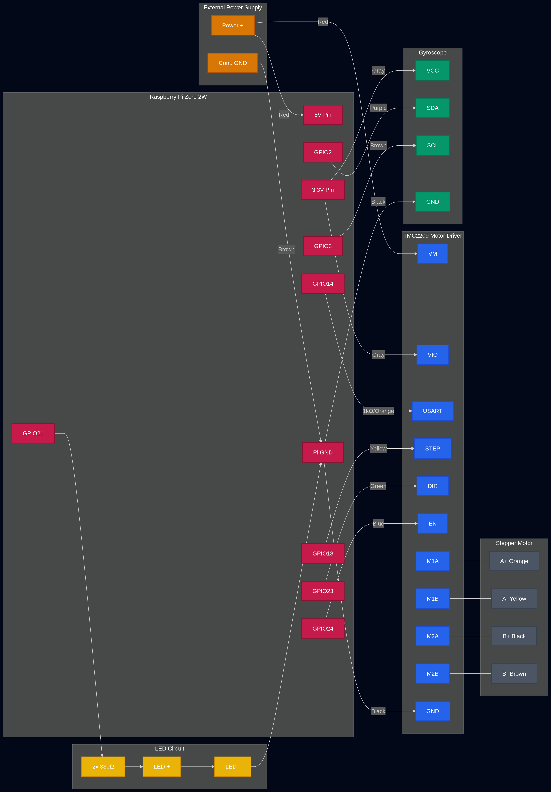
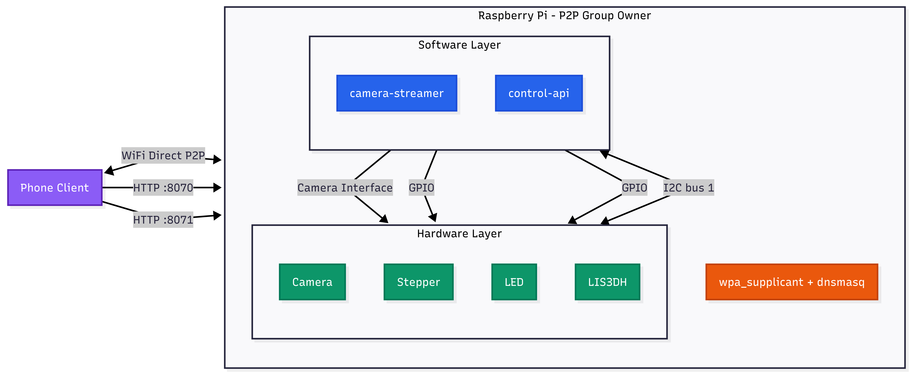
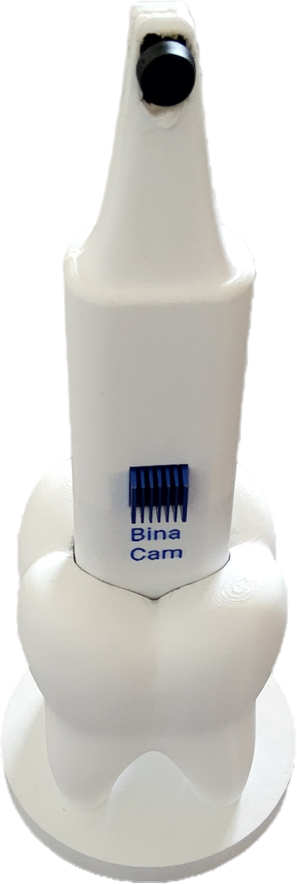

<p align="center">
  <picture>
    <source media="(prefers-color-scheme: dark)" srcset="assets/images/logos/bina_logo_blue.png">
    
  </picture>
</p>

# bina-hardware

Hardware side of the Bina intraoral camera. Everything on this repo runs on the on-device Raspberry Pi: a WiFi Direct access point that the companion phone app connects to, an MJPEG camera streamer, and an HTTP API that drives a stepper motor, an indicator LED and a LIS3DH accelerometer.

## Table of contents

1. [Overview](#overview)
2. [Hardware](#hardware)
3. [System architecture](#system-architecture)
4. [Boot and autostart chain](#boot-and-autostart-chain)
5. [Repository layout](#repository-layout)
6. [Installation](#installation)
7. [Network modes](#network-modes)
8. [HTTP APIs](#http-apis)
9. [File-by-file reference](#file-by-file-reference)
10. [Configuration reference](#configuration-reference)
11. [Development and testing](#development-and-testing)
12. [Troubleshooting](#troubleshooting)
13. [Recent notable changes](#recent-notable-changes)

## Overview

The Pi boots directly into WiFi Direct mode, advertising an SSID of `Bina-Camera`. A phone pairs over WPS (PIN `12345678`), gets a DHCP lease inside `192.168.1.10` to `192.168.1.50`, and can then reach two HTTP services on the Pi at `192.168.1.2`:

| Service | Port | Purpose |
|---|---|---|
| Camera streamer | 8070 | Live MJPEG plus full-resolution JPEG snapshot |
| Control API | 8071 | Motor moves, LED toggle, LIS3DH accelerometer readings |

All three parts (WiFi Direct, streamer, control API) are managed by `systemd` units that come up automatically at boot. A one-shot [`init.sh`](https://github.com/TheLongNoodle/bina-hardware/blob/main/init.sh) does the initial setup, and [`cleanup.sh`](https://github.com/TheLongNoodle/bina-hardware/blob/main/cleanup.sh) rolls it back.

## Hardware

### Bill of materials

| Part | Role | Notes |
|---|---|---|
| Raspberry Pi with `wlan0` capable of P2P | Compute + WiFi Direct GO | Tested on Pi 4 based on the CPU comment in [`libcamera-streamer.py#L228`](https://github.com/TheLongNoodle/bina-hardware/blob/main/scripts/libcamera-streamer.py#L228) |
| Pi Camera Module 3 | Video and stills | Native 4608x2592, we use 640x360 for the live stream and 1920x1080 for snapshots |
| Stepper motor + step/dir driver | Focus / positioning motion | Wired to STEP/DIR/EN, driver EN is active LOW |
| LIS3DH accelerometer breakout | Orientation (pitch/roll) | I2C bus 1, address 0x18 (or 0x19 if SA0 is high) |
| LED | Status indicator | Direct GPIO drive, controlled by `gpiozero.LED` |

### GPIO pin assignments

Pins are declared in [`scripts/control-api.py#L143`](https://github.com/TheLongNoodle/bina-hardware/blob/main/scripts/control-api.py#L143) through [`#L148`](https://github.com/TheLongNoodle/bina-hardware/blob/main/scripts/control-api.py#L148) and again in [`scripts/motor-example.py#L5`](https://github.com/TheLongNoodle/bina-hardware/blob/main/scripts/motor-example.py#L5) through [`#L7`](https://github.com/TheLongNoodle/bina-hardware/blob/main/scripts/motor-example.py#L7).

| Signal | GPIO (BCM) | Direction | Notes |
|---|---|---|---|
| LED | 21 | Output | `gpiozero.LED(21)` at [`control-api.py#L143`](https://github.com/TheLongNoodle/bina-hardware/blob/main/scripts/control-api.py#L143) |
| Motor STEP | 18 | Output pulse | One 1/0 pulse per microstep |
| Motor DIR | 23 | Output | 1 = forward, 0 = backward |
| Motor EN | 24 | Output | Active LOW: 0 enables driver, 1 disables. Held HIGH at boot to keep the coils cold, see [`control-api.py#L157`](https://github.com/TheLongNoodle/bina-hardware/blob/main/scripts/control-api.py#L157) |

### I2C sensor

| Device | Bus | Address | WHO_AM_I | Config |
|---|---|---|---|---|
| LIS3DH | 1 (SDA=GPIO2, SCL=GPIO3) | 0x18 primary, 0x19 fallback | 0x33 | CTRL_REG1=0x57 (100 Hz, XYZ enabled), CTRL_REG4=0x08 (+/- 2 g, high-res) |

Address auto-detection is at [`control-api.py#L32`](https://github.com/TheLongNoodle/bina-hardware/blob/main/scripts/control-api.py#L32); register writes at [`#L54`](https://github.com/TheLongNoodle/bina-hardware/blob/main/scripts/control-api.py#L54) and [`#L58`](https://github.com/TheLongNoodle/bina-hardware/blob/main/scripts/control-api.py#L58).

### Wiring diagram

<details>
<summary>hardware schema</summary>

[//]: # (![hardware schema]&#40;assets/diagrams/bina_hardware_schematics.png&#41;)

</details>

## System architecture

### Component diagram

<details>
<summary>componant graph</summary>

[//]: # (![componant graph]&#40;assets/diagrams/bina_hardware_componant_graph.png&#41;)


</details>

### Network topology

```
Phone (companion app)
   |
   |  WiFi Direct P2P group "Bina-Camera"  (WPS PIN 12345678)
   |  DHCP lease from 192.168.1.10 to 192.168.1.50
   |
Raspberry Pi
 - wlan0                : underlying WiFi radio
 - p2p-wlan0-0          : P2P Group Owner interface, 192.168.1.2/24
 - dnsmasq              : DHCP + DNS for p2p-wlan0-0
 - :8070  libcamera-streamer.py  (MJPEG + snapshot)
 - :8071  control-api.py         (motor / LED / LIS3DH)
 - GPIO 18/23/24        : stepper STEP/DIR/EN
 - GPIO 21              : status LED
 - I2C bus 1, 0x18/0x19 : LIS3DH accelerometer
```

## Boot and autostart chain

### Sequence

Text version:

1. `network.target` is reached.
2. [`WiFiDirectAutorun.service`](https://github.com/TheLongNoodle/bina-hardware/blob/main/wpa_supplicant/WiFiDirectAutorun.service) runs [`WiFiDirectAutorun.sh`](https://github.com/TheLongNoodle/bina-hardware/blob/main/wpa_supplicant/WiFiDirectAutorun.sh), which kills any old `wpa_supplicant`, brings up `wlan0`, spawns a fresh `wpa_supplicant` with our conf, adds the P2P group, assigns `192.168.1.2/24` to `p2p-wlan0-0`, launches `dnsmasq`, and arms WPS.
3. [`camera-streamer.service`](https://github.com/TheLongNoodle/bina-hardware/blob/main/scripts/camera-streamer.service) starts [`libcamera-streamer.py`](https://github.com/TheLongNoodle/bina-hardware/blob/main/scripts/libcamera-streamer.py) once the P2P service is up.
4. [`control-api.service`](https://github.com/TheLongNoodle/bina-hardware/blob/main/scripts/control-api.service) starts [`control-api.py`](https://github.com/TheLongNoodle/bina-hardware/blob/main/scripts/control-api.py) once both `network.target` and the P2P service are up.
5. The shell script drops into an infinite loop that re-arms the WPS PIN every 30 seconds and rebuilds the P2P group if `p2p-wlan0-0` ever disappears ([`WiFiDirectAutorun.sh#L79`](https://github.com/TheLongNoodle/bina-hardware/blob/main/wpa_supplicant/WiFiDirectAutorun.sh#L79)).

### systemd services

| Unit | Source | ExecStart | Restart | After | Runs as |
|---|---|---|---|---|---|
| `WiFiDirectAutorun.service` | [file](https://github.com/TheLongNoodle/bina-hardware/blob/main/wpa_supplicant/WiFiDirectAutorun.service) | [`WiFiDirectAutorun.sh`](https://github.com/TheLongNoodle/bina-hardware/blob/main/wpa_supplicant/WiFiDirectAutorun.sh) | on-failure ([L8](https://github.com/TheLongNoodle/bina-hardware/blob/main/wpa_supplicant/WiFiDirectAutorun.service#L8)) | `network.target` ([L3](https://github.com/TheLongNoodle/bina-hardware/blob/main/wpa_supplicant/WiFiDirectAutorun.service#L3)) | root (implicit, sudo inside script) |
| `camera-streamer.service` | [file](https://github.com/TheLongNoodle/bina-hardware/blob/main/scripts/camera-streamer.service) | `python3 libcamera-streamer.py` ([L8](https://github.com/TheLongNoodle/bina-hardware/blob/main/scripts/camera-streamer.service#L8)) | always ([L9](https://github.com/TheLongNoodle/bina-hardware/blob/main/scripts/camera-streamer.service#L9)) | `WiFiDirectAutorun.service` ([L3](https://github.com/TheLongNoodle/bina-hardware/blob/main/scripts/camera-streamer.service#L3)) | default user |
| `control-api.service` | [file](https://github.com/TheLongNoodle/bina-hardware/blob/main/scripts/control-api.service) | `python3 control-api.py` ([L9](https://github.com/TheLongNoodle/bina-hardware/blob/main/scripts/control-api.service#L9)) | on-failure ([L10](https://github.com/TheLongNoodle/bina-hardware/blob/main/scripts/control-api.service#L10)) | `network.target`, `WiFiDirectAutorun.service` ([L3](https://github.com/TheLongNoodle/bina-hardware/blob/main/scripts/control-api.service#L3)) | `root` ([L7](https://github.com/TheLongNoodle/bina-hardware/blob/main/scripts/control-api.service#L7)) |

All three units target `multi-user.target` for install. `init.sh` rewrites their `ExecStart`/`WorkingDirectory` paths to match wherever the repo lives on disk, so the units are portable.

## Repository layout

```
bina-hardware/
  init.sh                     one-shot setup: packages, I2C, dnsmasq, services
  cleanup.sh                  undo everything init.sh did
  network-mode.sh             flip between WiFi Direct and regular WiFi
  test_connection.py          TCP echo server/client for smoke-testing the link
  schematics.docx             hardware schematics (binary)
  README.md                   this file
  scripts/
    control-api.py            HTTP API for motor, LED, LIS3DH (port 8071)
    control-api.service       systemd unit for the above
    libcamera-streamer.py     MJPEG streamer + snapshot (port 8070)
    camera-streamer.service   systemd unit for the streamer
    motor-example.py          minimal standalone motor test
    test-streamer.py          MJPEG streamer with synthetic frames, no camera
  wpa_supplicant/
    WiFiDirectAutorun.sh      brings up wlan0, P2P group, dnsmasq, WPS
    WiFiDirectAutorun.service systemd unit for the above
    wpa_supplicant.conf       device_name, GO intent, country, etc.
```

Every file above is documented under [File-by-file reference](#file-by-file-reference).

## Installation

Run once on a fresh Pi image, from the repo root:

```bash
chmod +x init.sh
./init.sh
```

[`init.sh`](https://github.com/TheLongNoodle/bina-hardware/blob/main/init.sh) is idempotent-ish and will:

1. `apt-get install` the packages listed below ([L11](https://github.com/TheLongNoodle/bina-hardware/blob/main/init.sh#L11)).
2. Enable the I2C interface via `raspi-config nonint do_i2c 0` ([L15](https://github.com/TheLongNoodle/bina-hardware/blob/main/init.sh#L15)).
3. Write `/etc/dnsmasq.d/p2p-wlan0.conf` with the DHCP range ([L19](https://github.com/TheLongNoodle/bina-hardware/blob/main/init.sh#L19) to [L25](https://github.com/TheLongNoodle/bina-hardware/blob/main/init.sh#L25)).
4. `chmod +x` all Python scripts and the WiFi Direct shell script.
5. Rewrite `ExecStart` and `WorkingDirectory` paths inside all three service files to point at the current checkout ([L39](https://github.com/TheLongNoodle/bina-hardware/blob/main/init.sh#L39) to [L42](https://github.com/TheLongNoodle/bina-hardware/blob/main/init.sh#L42)).
6. Symlink the three service files into `/etc/systemd/system/`.
7. Stop and disable NetworkManager (it fights `wpa_supplicant`).
8. `systemctl enable --now` all three services in the right order.
9. Print a summary of URLs (`http://192.168.1.2:8070/`, `http://192.168.1.2:8071/`) and useful debug commands.

### Packages installed

| Package | Reason |
|---|---|
| `dnsmasq` | DHCP server on `p2p-wlan0-0` |
| `wpasupplicant` | WiFi Direct P2P stack |
| `python3-picamera2` | Pi Camera 3 Python bindings |
| `python3-simplejpeg` | Fast JPEG encoding for snapshots |
| `python3-smbus` | I2C for the LIS3DH |
| `i2c-tools` | `i2cdetect` and friends for debugging |

Additional Python modules used but not installed by `init.sh` (they ship with Raspberry Pi OS): `gpiozero`, `lgpio`, `smbus2`, plus the standard library (`http.server`, `socketserver`, `threading`, `socket`, `math`, `json`, `time`, `io`, `logging`, `subprocess`, `datetime`).

### Rolling back

```bash
./cleanup.sh
```

[`cleanup.sh`](https://github.com/TheLongNoodle/bina-hardware/blob/main/cleanup.sh) stops and disables the two `WiFiDirectAutorun`/`camera-streamer` units, kills `wpa_supplicant` and `dnsmasq`, drops the P2P interface, removes the systemd symlinks and the dnsmasq drop-in, and reloads systemd. Worth noting: it does not stop or remove `control-api.service` (see [Known quirks](#known-quirks)).

## Network modes

The Pi normally lives in WiFi Direct mode so the phone can find it. When you need to SSH or SCP files (upgrades, log pulls), flip it to regular WiFi:

```bash
./network-mode.sh wifi     # switch to regular WiFi (SSH-friendly)
./network-mode.sh p2p      # switch back to WiFi Direct (phone-friendly)
./network-mode.sh status   # show current mode and interfaces
```

The switch is implemented in [`network-mode.sh`](https://github.com/TheLongNoodle/bina-hardware/blob/main/network-mode.sh):

- `wifi_mode()` at [L29](https://github.com/TheLongNoodle/bina-hardware/blob/main/network-mode.sh#L29) stops the P2P services and starts NetworkManager.
- `p2p_mode()` at [L56](https://github.com/TheLongNoodle/bina-hardware/blob/main/network-mode.sh#L56) does the opposite.
- `status()` at [L13](https://github.com/TheLongNoodle/bina-hardware/blob/main/network-mode.sh#L13) checks which of the two managers is currently active.

## HTTP APIs

### Camera streamer, port 8070

Source: [`scripts/libcamera-streamer.py`](https://github.com/TheLongNoodle/bina-hardware/blob/main/scripts/libcamera-streamer.py).

<details>
<summary>Endpoints</summary>

| Method | Path | Purpose | Source |
|---|---|---|---|
| GET | `/` | HTML page with the embedded stream and a snapshot link | [L107](https://github.com/TheLongNoodle/bina-hardware/blob/main/scripts/libcamera-streamer.py#L107) |
| GET | `/stream.mjpg` | Live MJPEG at 640x360, multipart boundary `FRAME` | [L115](https://github.com/TheLongNoodle/bina-hardware/blob/main/scripts/libcamera-streamer.py#L115) |
| GET | `/snapshot.jpg` | Full-resolution 1920x1080 JPEG, quality 80 | [L121](https://github.com/TheLongNoodle/bina-hardware/blob/main/scripts/libcamera-streamer.py#L121) |

The snapshot handler acquires a `threading.Lock` ([`#L233`](https://github.com/TheLongNoodle/bina-hardware/blob/main/scripts/libcamera-streamer.py#L233), used at [`#L150`](https://github.com/TheLongNoodle/bina-hardware/blob/main/scripts/libcamera-streamer.py#L150)) so it can pause the live encoder, capture a still, then resume the encoder without stepping on itself.

</details>

### Control API, port 8071

<details>
<summary>Endpoints</summary>


Source: [`scripts/control-api.py`](https://github.com/TheLongNoodle/bina-hardware/blob/main/scripts/control-api.py).

| Method | Path | Body | Purpose | Source |
|---|---|---|---|---|
| GET | `/` | | Human-readable list of endpoints | [L237](https://github.com/TheLongNoodle/bina-hardware/blob/main/scripts/control-api.py#L237) |
| GET | `/status` | | `{is_moving, steps_per_rev, max_speed}` | [L231](https://github.com/TheLongNoodle/bina-hardware/blob/main/scripts/control-api.py#L231) |
| GET | `/led` | | Toggle LED, returns `{led: "on"\|"off"}` | [L272](https://github.com/TheLongNoodle/bina-hardware/blob/main/scripts/control-api.py#L272) |
| GET | `/gyro` | | All sensor data as one blob | [L253](https://github.com/TheLongNoodle/bina-hardware/blob/main/scripts/control-api.py#L253) |
| GET | `/gyro/accel` | | `{x, y, z, unit: "g"}` | [L255](https://github.com/TheLongNoodle/bina-hardware/blob/main/scripts/control-api.py#L255) |
| GET | `/gyro/rotation` | | Returns an error (LIS3DH has no gyro) | [L258](https://github.com/TheLongNoodle/bina-hardware/blob/main/scripts/control-api.py#L258) |
| GET | `/gyro/mag` | | Returns an error (LIS3DH has no magnetometer) | [L261](https://github.com/TheLongNoodle/bina-hardware/blob/main/scripts/control-api.py#L261) |
| GET | `/gyro/temp` | | Returns an error (not implemented) | [L264](https://github.com/TheLongNoodle/bina-hardware/blob/main/scripts/control-api.py#L264) |
| GET | `/gyro/orientation` | | `{pitch, roll, unit: "degrees"}` computed via `atan2` on the accel vector | [L267](https://github.com/TheLongNoodle/bina-hardware/blob/main/scripts/control-api.py#L267) |
| GET | `/gyro/status` | | Sensor init state, WHO_AM_I, range | [L270](https://github.com/TheLongNoodle/bina-hardware/blob/main/scripts/control-api.py#L270) |
| POST | `/move` | `{steps, direction}` | Step-count move, defaults `100`, `1` | [L287](https://github.com/TheLongNoodle/bina-hardware/blob/main/scripts/control-api.py#L287) |
| POST | `/rotate` | `{revolutions, direction}` | Move `revolutions * STEPS_PER_REV` steps | [L293](https://github.com/TheLongNoodle/bina-hardware/blob/main/scripts/control-api.py#L293) |
| POST | `/stop` | | Interrupt an ongoing move, disable driver | [L299](https://github.com/TheLongNoodle/bina-hardware/blob/main/scripts/control-api.py#L299) |
| POST | `/enable` | | Drive EN low (motor enabled) | [L303](https://github.com/TheLongNoodle/bina-hardware/blob/main/scripts/control-api.py#L303) |
| POST | `/disable` | | Drive EN high (motor disabled) | [L307](https://github.com/TheLongNoodle/bina-hardware/blob/main/scripts/control-api.py#L307) |
| POST | `/led` | `{count}` | Blink LED `count` times at 0.5 s on/off | [L311](https://github.com/TheLongNoodle/bina-hardware/blob/main/scripts/control-api.py#L311) |

</details>

### Known quirks

Worth knowing before a live demo:

1. The `/gyro/*` endpoints are named after the older MPU9250 driver that used to live here (moved out due to the heat lol). The current sensor is a LIS3DH, which has no gyroscope or magnetometer, so `/gyro/rotation` and `/gyro/mag` intentionally return `{"error": ...}`. The instance is still called `mpu` at [`control-api.py#L142`](https://github.com/TheLongNoodle/bina-hardware/blob/main/scripts/control-api.py#L142) for the same reason. Renaming was skipped on purpose so the phone app did not need to change.
2. `MIN_SPEED` and `MAX_SPEED` are both `200` in [`control-api.py#L161`](https://github.com/TheLongNoodle/bina-hardware/blob/main/scripts/control-api.py#L161) and [`#L162`](https://github.com/TheLongNoodle/bina-hardware/blob/main/scripts/control-api.py#L162), so the acceleration ramp at [`#L189`](https://github.com/TheLongNoodle/bina-hardware/blob/main/scripts/control-api.py#L189) is effectively a no-op. If we want real ramp-up we would lower `MIN_SPEED`.
3. `test-streamer.py` and `libcamera-streamer.py` both bind port `8070`. Only one can run at a time. but thats ok since the test streamer was mostly made when we didn't have access to a camera.

## File-by-file reference

<details>
<summary><b>scripts/control-api.py</b> HTTP API for motor, LED, LIS3DH (port 8071)</summary>

Source: [`scripts/control-api.py`](https://github.com/TheLongNoodle/bina-hardware/blob/main/scripts/control-api.py). About 350 lines. This is the main file to look at during a demo.

Three logical sections:

**1. LIS3DH driver class**, [`#L22`](https://github.com/TheLongNoodle/bina-hardware/blob/main/scripts/control-api.py#L22) to [`#L139`](https://github.com/TheLongNoodle/bina-hardware/blob/main/scripts/control-api.py#L139).

- Opens `smbus2.SMBus(1)` and probes 0x18 then 0x19 for a device that returns `0x33` on WHO_AM_I ([`#L32`](https://github.com/TheLongNoodle/bina-hardware/blob/main/scripts/control-api.py#L32)).
- Writes `CTRL_REG1 = 0x57` (100 Hz, X/Y/Z on) at [`#L54`](https://github.com/TheLongNoodle/bina-hardware/blob/main/scripts/control-api.py#L54) and `CTRL_REG4 = 0x08` (+/- 2 g, high resolution) at [`#L58`](https://github.com/TheLongNoodle/bina-hardware/blob/main/scripts/control-api.py#L58).
- `_read_axis` at [`#L61`](https://github.com/TheLongNoodle/bina-hardware/blob/main/scripts/control-api.py#L61) does a 16-bit read with sign extension. The `| 0x80` in the register address enables I2C auto-increment.
- `read_accel` at [`#L78`](https://github.com/TheLongNoodle/bina-hardware/blob/main/scripts/control-api.py#L78) applies the `2.0 / 32768.0` scale from [`#L27`](https://github.com/TheLongNoodle/bina-hardware/blob/main/scripts/control-api.py#L27).
- `get_orientation` at [`#L111`](https://github.com/TheLongNoodle/bina-hardware/blob/main/scripts/control-api.py#L111) computes pitch and roll: `pitch = atan2(-ax, sqrt(ay^2 + az^2))` and `roll = atan2(ay, az)`, both converted to degrees ([`#L122`](https://github.com/TheLongNoodle/bina-hardware/blob/main/scripts/control-api.py#L122) to [`#L123`](https://github.com/TheLongNoodle/bina-hardware/blob/main/scripts/control-api.py#L123)).

**2. GPIO setup and motor primitives**, [`#L141`](https://github.com/TheLongNoodle/bina-hardware/blob/main/scripts/control-api.py#L141) to [`#L214`](https://github.com/TheLongNoodle/bina-hardware/blob/main/scripts/control-api.py#L214).

- Pins claimed via `lgpio` at [`#L150`](https://github.com/TheLongNoodle/bina-hardware/blob/main/scripts/control-api.py#L150) to [`#L154`](https://github.com/TheLongNoodle/bina-hardware/blob/main/scripts/control-api.py#L154).
- Driver is left disabled at boot ([`#L157`](https://github.com/TheLongNoodle/bina-hardware/blob/main/scripts/control-api.py#L157)).
- Motor tuning constants at [`#L159`](https://github.com/TheLongNoodle/bina-hardware/blob/main/scripts/control-api.py#L159) to [`#L163`](https://github.com/TheLongNoodle/bina-hardware/blob/main/scripts/control-api.py#L163). `STEPS_PER_REV = 1600`, `MAX_SPEED = MIN_SPEED = 200`, `ACCEL = 5`.
- `step_pulse` at [`#L166`](https://github.com/TheLongNoodle/bina-hardware/blob/main/scripts/control-api.py#L166) is the lowest-level primitive: one high, one low, each held for `delay` seconds.
- `move(steps, direction)` at [`#L173`](https://github.com/TheLongNoodle/bina-hardware/blob/main/scripts/control-api.py#L173) sets a global `is_moving` flag, enables the driver, waits 10 ms for it to settle, and loops step-pulses at `delay = 1 / (2 * speed)`. The loop bails early if `is_moving` is flipped by `/stop`.
- `rotate(revolutions, direction)` at [`#L200`](https://github.com/TheLongNoodle/bina-hardware/blob/main/scripts/control-api.py#L200) is just `move(revolutions * STEPS_PER_REV, direction)`.
- `stop_motor`, `disable_motor`, `enable_motor` at [`#L204`](https://github.com/TheLongNoodle/bina-hardware/blob/main/scripts/control-api.py#L204), [`#L209`](https://github.com/TheLongNoodle/bina-hardware/blob/main/scripts/control-api.py#L209), [`#L213`](https://github.com/TheLongNoodle/bina-hardware/blob/main/scripts/control-api.py#L213).

**3. HTTP handler `MotorHandler`**, [`#L216`](https://github.com/TheLongNoodle/bina-hardware/blob/main/scripts/control-api.py#L216) to [`#L327`](https://github.com/TheLongNoodle/bina-hardware/blob/main/scripts/control-api.py#L216).

- `send_json` and `read_json_body` helpers at [`#L217`](https://github.com/TheLongNoodle/bina-hardware/blob/main/scripts/control-api.py#L217) and [`#L223`](https://github.com/TheLongNoodle/bina-hardware/blob/main/scripts/control-api.py#L223).
- `do_GET` dispatches the read endpoints at [`#L230`](https://github.com/TheLongNoodle/bina-hardware/blob/main/scripts/control-api.py#L230).
- `do_POST` dispatches the action endpoints at [`#L283`](https://github.com/TheLongNoodle/bina-hardware/blob/main/scripts/control-api.py#L283). Wraps everything in `try/except` and returns `500` with `{"error": str(e)}` on any exception ([`#L326`](https://github.com/TheLongNoodle/bina-hardware/blob/main/scripts/control-api.py#L326)).
- Server binds `0.0.0.0:8071` at [`#L347`](https://github.com/TheLongNoodle/bina-hardware/blob/main/scripts/control-api.py#L347).

</details>

<details>
<summary><b>scripts/libcamera-streamer.py</b> MJPEG streamer plus full-res snapshot (port 8070)</summary>

Source: [`scripts/libcamera-streamer.py`](https://github.com/TheLongNoodle/bina-hardware/blob/main/scripts/libcamera-streamer.py). Written on top of `picamera2` and `simplejpeg`.

Constants worth knowing:

- `STREAM_SIZE = (640, 360)` at [`#L24`](https://github.com/TheLongNoodle/bina-hardware/blob/main/scripts/libcamera-streamer.py#L24), the live stream resolution.
- `PORT = 8070` at [`#L27`](https://github.com/TheLongNoodle/bina-hardware/blob/main/scripts/libcamera-streamer.py#L27).
- `TRANSFORM = libcamera.Transform()` at [`#L30`](https://github.com/TheLongNoodle/bina-hardware/blob/main/scripts/libcamera-streamer.py#L30). Swap in `Transform(rotation=180)` if the camera is mounted upside-down.
- `SENSOR_MODE = (1920, 1080)` at [`#L41`](https://github.com/TheLongNoodle/bina-hardware/blob/main/scripts/libcamera-streamer.py#L41), the raw sensor mode we ask the ISP to feed us from.
- `CONTROLS = {"ExposureValue": 0}` at [`#L43`](https://github.com/TheLongNoodle/bina-hardware/blob/main/scripts/libcamera-streamer.py#L43) to [`#L51`](https://github.com/TheLongNoodle/bina-hardware/blob/main/scripts/libcamera-streamer.py#L51).

Key classes and flow:

- `gen_index_page` at [`#L58`](https://github.com/TheLongNoodle/bina-hardware/blob/main/scripts/libcamera-streamer.py#L58) builds the HTML at `/` with the live `` and a link to the snapshot.
- `StreamingOutput` at [`#L87`](https://github.com/TheLongNoodle/bina-hardware/blob/main/scripts/libcamera-streamer.py#L87) is the buffered writer the encoder pushes JPEG frames into. It uses a `threading.Condition` so the streaming loop can `wait()` for the next frame instead of polling.
- `StreamingHandler.do_GET` at [`#L104`](https://github.com/TheLongNoodle/bina-hardware/blob/main/scripts/libcamera-streamer.py#L104) routes `/`, `/stream.mjpg` and `/snapshot.jpg`.
- `_stream_jpeg` at [`#L127`](https://github.com/TheLongNoodle/bina-hardware/blob/main/scripts/libcamera-streamer.py#L127) writes an infinite `multipart/x-mixed-replace` response.
- `_send_snapshot` at [`#L145`](https://github.com/TheLongNoodle/bina-hardware/blob/main/scripts/libcamera-streamer.py#L145):
    1. Takes `picam2_lock` ([`#L150`](https://github.com/TheLongNoodle/bina-hardware/blob/main/scripts/libcamera-streamer.py#L150)).
    2. Stops the live encoder ([`#L154`](https://github.com/TheLongNoodle/bina-hardware/blob/main/scripts/libcamera-streamer.py#L154)).
    3. Calls `switch_mode_and_capture_array` for a full-resolution frame ([`#L165`](https://github.com/TheLongNoodle/bina-hardware/blob/main/scripts/libcamera-streamer.py#L165)).
    4. Restarts the live encoder ([`#L169`](https://github.com/TheLongNoodle/bina-hardware/blob/main/scripts/libcamera-streamer.py#L169)).
    5. Encodes the still with `simplejpeg` at quality 80, 4:2:0 ([`#L173`](https://github.com/TheLongNoodle/bina-hardware/blob/main/scripts/libcamera-streamer.py#L173) to [`#L177`](https://github.com/TheLongNoodle/bina-hardware/blob/main/scripts/libcamera-streamer.py#L177)).
- `StreamingServer` at [`#L187`](https://github.com/TheLongNoodle/bina-hardware/blob/main/scripts/libcamera-streamer.py#L187) mixes `ThreadingMixIn` in so many clients can watch the stream at once.
- `MJPEGEncoder` is picked over the software `JpegEncoder` at [`#L228`](https://github.com/TheLongNoodle/bina-hardware/blob/main/scripts/libcamera-streamer.py#L228). Comment records 22 percent CPU at 640x480 on a Pi 4, vs 46 percent for the software encoder.

The commented block at the top of the file ([`#L1`](https://github.com/TheLongNoodle/bina-hardware/blob/main/scripts/libcamera-streamer.py#L1) to [`#L7`](https://github.com/TheLongNoodle/bina-hardware/blob/main/scripts/libcamera-streamer.py#L7)) links to the upstream picamera2 example this was derived from.

</details>

<details>
<summary><b>scripts/test-streamer.py</b> synthetic-frame streamer for testing WiFi Direct without a camera</summary>

Source: [`scripts/test-streamer.py`](https://github.com/TheLongNoodle/bina-hardware/blob/main/scripts/test-streamer.py). Same endpoints as the real streamer, so the phone app can test its playback path even when the camera is not plugged in.

- Same `PORT = 8070` and `STREAM_SIZE = (640, 360)` ([`#L14`](https://github.com/TheLongNoodle/bina-hardware/blob/main/scripts/test-streamer.py#L14), [`#L15`](https://github.com/TheLongNoodle/bina-hardware/blob/main/scripts/test-streamer.py#L15)).
- `generate_test_frame_pil` at [`#L27`](https://github.com/TheLongNoodle/bina-hardware/blob/main/scripts/test-streamer.py#L27) draws color bars, a border, and the current timestamp with PIL and encodes to JPEG.
- `generate_test_frame_minimal` at [`#L68`](https://github.com/TheLongNoodle/bina-hardware/blob/main/scripts/test-streamer.py#L68) is a hard-coded minimal gray JPEG used as a fallback if PIL is not installed.
- `do_GET` at [`#L140`](https://github.com/TheLongNoodle/bina-hardware/blob/main/scripts/test-streamer.py#L140) serves `/`, `/stream.mjpg` (10 FPS via `time.sleep(0.1)` at [`#L179`](https://github.com/TheLongNoodle/bina-hardware/blob/main/scripts/test-streamer.py#L179)) and `/snapshot.jpg`.
- Startup banner hard-codes the Pi IP in its printed URLs at [`#L207`](https://github.com/TheLongNoodle/bina-hardware/blob/main/scripts/test-streamer.py#L207) to [`#L209`](https://github.com/TheLongNoodle/bina-hardware/blob/main/scripts/test-streamer.py#L209).

</details>

<details>
<summary><b>scripts/motor-example.py</b> minimal standalone motor test</summary>

Source: [`scripts/motor-example.py`](https://github.com/TheLongNoodle/bina-hardware/blob/main/scripts/motor-example.py). Forty lines. Kept as a reference for the raw stepping pattern outside of the HTTP layer.

- Pins declared at [`#L5`](https://github.com/TheLongNoodle/bina-hardware/blob/main/scripts/motor-example.py#L5) to [`#L7`](https://github.com/TheLongNoodle/bina-hardware/blob/main/scripts/motor-example.py#L7).
- Driver enabled at [`#L16`](https://github.com/TheLongNoodle/bina-hardware/blob/main/scripts/motor-example.py#L16), disabled in the `finally` at [`#L38`](https://github.com/TheLongNoodle/bina-hardware/blob/main/scripts/motor-example.py#L38).
- `STEPS_PER_REV = 1600`, `DELAY = 0.002` at [`#L19`](https://github.com/TheLongNoodle/bina-hardware/blob/main/scripts/motor-example.py#L19) to [`#L20`](https://github.com/TheLongNoodle/bina-hardware/blob/main/scripts/motor-example.py#L20).
- `rotate` at [`#L23`](https://github.com/TheLongNoodle/bina-hardware/blob/main/scripts/motor-example.py#L23). The `for _ in int(...)` at [`#L25`](https://github.com/TheLongNoodle/bina-hardware/blob/main/scripts/motor-example.py#L25) is buggy (int is not iterable). Use the real `control-api.py` for actual moves.

</details>

<details>
<summary><b>scripts/*.service</b> systemd units for the two Python daemons</summary>

[`scripts/control-api.service`](https://github.com/TheLongNoodle/bina-hardware/blob/main/scripts/control-api.service):

- Runs as `root` ([L7](https://github.com/TheLongNoodle/bina-hardware/blob/main/scripts/control-api.service#L7)) because it touches GPIO and I2C.
- `After=network.target WiFiDirectAutorun.service` at [L3](https://github.com/TheLongNoodle/bina-hardware/blob/main/scripts/control-api.service#L3).
- `Restart=on-failure` with a 5 second cooldown.
- `WorkingDirectory` and `ExecStart` are rewritten by `init.sh` to point at the current repo path.

[`scripts/camera-streamer.service`](https://github.com/TheLongNoodle/bina-hardware/blob/main/scripts/camera-streamer.service):

- `Restart=always` at [L9](https://github.com/TheLongNoodle/bina-hardware/blob/main/scripts/camera-streamer.service#L9). Any exit reason triggers a restart, because losing the stream is annoying during a demo.
- `Environment=PYTHONUNBUFFERED=1` at [L13](https://github.com/TheLongNoodle/bina-hardware/blob/main/scripts/camera-streamer.service#L13) so `journalctl` shows log lines immediately.

</details>

<details>
<summary><b>wpa_supplicant/WiFiDirectAutorun.sh</b> bring up WiFi Direct + DHCP + WPS</summary>

Source: [`wpa_supplicant/WiFiDirectAutorun.sh`](https://github.com/TheLongNoodle/bina-hardware/blob/main/wpa_supplicant/WiFiDirectAutorun.sh). Not using `set -e` on purpose ([`#L2`](https://github.com/TheLongNoodle/bina-hardware/blob/main/wpa_supplicant/WiFiDirectAutorun.sh#L2)): the monitoring loop at the bottom must keep running even if a single `wpa_cli` call fails.

Startup ([`#L12`](https://github.com/TheLongNoodle/bina-hardware/blob/main/wpa_supplicant/WiFiDirectAutorun.sh#L12) to [`#L65`](https://github.com/TheLongNoodle/bina-hardware/blob/main/wpa_supplicant/WiFiDirectAutorun.sh#L65)):

1. Kill any stale `wpa_supplicant`, then bring `wlan0` up.
2. Start `wpa_supplicant -B -iwlan0 -Dnl80211 -c wpa_supplicant.conf` at [`#L26`](https://github.com/TheLongNoodle/bina-hardware/blob/main/wpa_supplicant/WiFiDirectAutorun.sh#L26).
3. `wpa_cli -iwlan0 p2p_group_add` to create the group at [`#L31`](https://github.com/TheLongNoodle/bina-hardware/blob/main/wpa_supplicant/WiFiDirectAutorun.sh#L31), then poll for the `p2p-wlan0-0` interface with a ten-second timeout at [`#L36`](https://github.com/TheLongNoodle/bina-hardware/blob/main/wpa_supplicant/WiFiDirectAutorun.sh#L36).
4. Assign `192.168.1.2/24` to the new interface at [`#L47`](https://github.com/TheLongNoodle/bina-hardware/blob/main/wpa_supplicant/WiFiDirectAutorun.sh#L47).
5. Start `dnsmasq` against `/etc/dnsmasq.d/p2p-wlan0.conf` at [`#L54`](https://github.com/TheLongNoodle/bina-hardware/blob/main/wpa_supplicant/WiFiDirectAutorun.sh#L54).
6. Arm WPS in both Push-Button and PIN mode at [`#L58`](https://github.com/TheLongNoodle/bina-hardware/blob/main/wpa_supplicant/WiFiDirectAutorun.sh#L58) and [`#L60`](https://github.com/TheLongNoodle/bina-hardware/blob/main/wpa_supplicant/WiFiDirectAutorun.sh#L60). PIN is `12345678`.

Monitor loop ([`#L79`](https://github.com/TheLongNoodle/bina-hardware/blob/main/wpa_supplicant/WiFiDirectAutorun.sh#L79) to [`#L98`](https://github.com/TheLongNoodle/bina-hardware/blob/main/wpa_supplicant/WiFiDirectAutorun.sh#L98)):

- Every 30 seconds, if `p2p-wlan0-0` is still up, re-arm the WPS PIN so a new phone can join. This is what lets a phone pair even if it was rebooted or shows up hours after the Pi did.
- If the interface has vanished, rerun `p2p_group_add`, reassign the IP, restart `dnsmasq`, re-arm WPS.

</details>

<details>
<summary><b>wpa_supplicant/WiFiDirectAutorun.service</b></summary>

Source: [`wpa_supplicant/WiFiDirectAutorun.service`](https://github.com/TheLongNoodle/bina-hardware/blob/main/wpa_supplicant/WiFiDirectAutorun.service).

- `After=network.target` and `Wants=network.target` ([L3](https://github.com/TheLongNoodle/bina-hardware/blob/main/wpa_supplicant/WiFiDirectAutorun.service#L3), [L4](https://github.com/TheLongNoodle/bina-hardware/blob/main/wpa_supplicant/WiFiDirectAutorun.service#L4)).
- `Restart=on-failure`, five second delay ([L8](https://github.com/TheLongNoodle/bina-hardware/blob/main/wpa_supplicant/WiFiDirectAutorun.service#L8), [L9](https://github.com/TheLongNoodle/bina-hardware/blob/main/wpa_supplicant/WiFiDirectAutorun.service#L9)).
- `ExecStop=/usr/bin/wpa_cli -iwlan0 p2p_group_remove p2p-wlan0-0` ([L11](https://github.com/TheLongNoodle/bina-hardware/blob/main/wpa_supplicant/WiFiDirectAutorun.service#L11)) tears the group down cleanly when the unit stops.

</details>

<details>
<summary><b>wpa_supplicant/wpa_supplicant.conf</b> P2P / WiFi Direct configuration</summary>

Source: [`wpa_supplicant/wpa_supplicant.conf`](https://github.com/TheLongNoodle/bina-hardware/blob/main/wpa_supplicant/wpa_supplicant.conf). Fifteen lines. Read at boot by the `wpa_supplicant` daemon started from the script above.

| Line | Directive | Effect |
|---|---|---|
| [L1](https://github.com/TheLongNoodle/bina-hardware/blob/main/wpa_supplicant/wpa_supplicant.conf#L1) | `ctrl_interface=DIR=/var/run/wpa_supplicant GROUP=netdev` | Where `wpa_cli` connects |
| [L2](https://github.com/TheLongNoodle/bina-hardware/blob/main/wpa_supplicant/wpa_supplicant.conf#L2) | `update_config=1` | Allow `wpa_cli` to write back to this file |
| [L3](https://github.com/TheLongNoodle/bina-hardware/blob/main/wpa_supplicant/wpa_supplicant.conf#L3) | `device_name=Bina-Camera` | Name the phone sees |
| [L4](https://github.com/TheLongNoodle/bina-hardware/blob/main/wpa_supplicant/wpa_supplicant.conf#L4) | `device_type=1-0050F204-1` | WPS "computer / PC" category, generic |
| [L5](https://github.com/TheLongNoodle/bina-hardware/blob/main/wpa_supplicant/wpa_supplicant.conf#L5) | `driver_param=use_p2p_group_interface=1` | Spin up `p2p-wlan0-0` as its own interface |
| [L9](https://github.com/TheLongNoodle/bina-hardware/blob/main/wpa_supplicant/wpa_supplicant.conf#L9) | `p2p_go_intent=15` | Always be Group Owner (max value) |
| [L10](https://github.com/TheLongNoodle/bina-hardware/blob/main/wpa_supplicant/wpa_supplicant.conf#L10) | `p2p_go_ht40=1` | Use 40 MHz channels when possible |
| [L11](https://github.com/TheLongNoodle/bina-hardware/blob/main/wpa_supplicant/wpa_supplicant.conf#L11) | `p2p_go_max_inactivity=0` | Never disconnect an idle client |
| [L14](https://github.com/TheLongNoodle/bina-hardware/blob/main/wpa_supplicant/wpa_supplicant.conf#L14) | `country=IL` | Regulatory domain (Israel). Change to match your region. |

</details>

<details>
<summary><b>init.sh</b> one-shot install and enable</summary>

Source: [`init.sh`](https://github.com/TheLongNoodle/bina-hardware/blob/main/init.sh). Numbered `[N/10]` steps in the log output map one-to-one to script sections:

| Step | Lines | What it does |
|---|---|---|
| 1/10 | [L9](https://github.com/TheLongNoodle/bina-hardware/blob/main/init.sh#L9) to [L11](https://github.com/TheLongNoodle/bina-hardware/blob/main/init.sh#L11) | apt-get install packages |
| 2/10 | [L14](https://github.com/TheLongNoodle/bina-hardware/blob/main/init.sh#L14) to [L15](https://github.com/TheLongNoodle/bina-hardware/blob/main/init.sh#L15) | Enable I2C |
| 3/10 | [L18](https://github.com/TheLongNoodle/bina-hardware/blob/main/init.sh#L18) to [L29](https://github.com/TheLongNoodle/bina-hardware/blob/main/init.sh#L29) | Write `/etc/dnsmasq.d/p2p-wlan0.conf`, disable system `dnsmasq` |
| 4/10 | [L32](https://github.com/TheLongNoodle/bina-hardware/blob/main/init.sh#L32) to [L35](https://github.com/TheLongNoodle/bina-hardware/blob/main/init.sh#L35) | `chmod +x` on scripts |
| 5/10 | [L38](https://github.com/TheLongNoodle/bina-hardware/blob/main/init.sh#L38) to [L50](https://github.com/TheLongNoodle/bina-hardware/blob/main/init.sh#L50) | Rewrite paths in all three service files, then symlink them into `/etc/systemd/system/` |
| 6/10 | [L53](https://github.com/TheLongNoodle/bina-hardware/blob/main/init.sh#L53) to [L57](https://github.com/TheLongNoodle/bina-hardware/blob/main/init.sh#L57) | Disable NetworkManager |
| 7/10 | [L60](https://github.com/TheLongNoodle/bina-hardware/blob/main/init.sh#L60) to [L63](https://github.com/TheLongNoodle/bina-hardware/blob/main/init.sh#L63) | `systemctl enable --now WiFiDirectAutorun.service` |
| 8/10 | [L66](https://github.com/TheLongNoodle/bina-hardware/blob/main/init.sh#L66) to [L68](https://github.com/TheLongNoodle/bina-hardware/blob/main/init.sh#L68) | `systemctl enable --now camera-streamer.service` |
| 9/10 | [L71](https://github.com/TheLongNoodle/bina-hardware/blob/main/init.sh#L71) to [L73](https://github.com/TheLongNoodle/bina-hardware/blob/main/init.sh#L73) | `systemctl enable --now control-api.service` |
| 10/10 | [L76](https://github.com/TheLongNoodle/bina-hardware/blob/main/init.sh#L76) to [L80](https://github.com/TheLongNoodle/bina-hardware/blob/main/init.sh#L80) | Verify each unit is active |

The dnsmasq drop-in written at [L19](https://github.com/TheLongNoodle/bina-hardware/blob/main/init.sh#L19) to [L25](https://github.com/TheLongNoodle/bina-hardware/blob/main/init.sh#L25) is the source of truth for the DHCP range, the router option and the DNS handed out to the phone.

</details>

<details>
<summary><b>cleanup.sh</b> undo init.sh</summary>

Source: [`cleanup.sh`](https://github.com/TheLongNoodle/bina-hardware/blob/main/cleanup.sh).

Stops and disables the two "network + camera" services ([L9](https://github.com/TheLongNoodle/bina-hardware/blob/main/cleanup.sh#L9) to [L12](https://github.com/TheLongNoodle/bina-hardware/blob/main/cleanup.sh#L12)), kills `wpa_supplicant` and `dnsmasq` ([L16](https://github.com/TheLongNoodle/bina-hardware/blob/main/cleanup.sh#L16) to [L17](https://github.com/TheLongNoodle/bina-hardware/blob/main/cleanup.sh#L17)), takes down `p2p-wlan0-0` ([L21](https://github.com/TheLongNoodle/bina-hardware/blob/main/cleanup.sh#L21)), removes the two systemd symlinks ([L25](https://github.com/TheLongNoodle/bina-hardware/blob/main/cleanup.sh#L25) to [L26](https://github.com/TheLongNoodle/bina-hardware/blob/main/cleanup.sh#L26)) and the dnsmasq drop-in ([L30](https://github.com/TheLongNoodle/bina-hardware/blob/main/cleanup.sh#L30)), then reloads systemd. It intentionally uses `|| true` on each command so a partial state (for example, WiFiDirect never started) does not abort the cleanup.

Does not touch `control-api.service`; that is a manual `systemctl stop` if you need it fully clean.

</details>

<details>
<summary><b>network-mode.sh</b> flip between WiFi Direct and regular WiFi</summary>

Source: [`network-mode.sh`](https://github.com/TheLongNoodle/bina-hardware/blob/main/network-mode.sh). Runs on the Pi itself when you need to SSH in (regular WiFi) or hand back to a phone (P2P).

- `usage` at [L4](https://github.com/TheLongNoodle/bina-hardware/blob/main/network-mode.sh#L4).
- `status` at [L13](https://github.com/TheLongNoodle/bina-hardware/blob/main/network-mode.sh#L13) infers the mode by asking `systemctl` which of `NetworkManager` or `wpa_supplicant` is active.
- `wifi_mode` at [L29](https://github.com/TheLongNoodle/bina-hardware/blob/main/network-mode.sh#L29): stops both P2P services, kills the daemons, drops the P2P interface, starts NetworkManager.
- `p2p_mode` at [L56](https://github.com/TheLongNoodle/bina-hardware/blob/main/network-mode.sh#L56): the reverse. Accepts both `p2p` and `direct` as aliases at [L80](https://github.com/TheLongNoodle/bina-hardware/blob/main/network-mode.sh#L80).

</details>

<details>
<summary><b>test_connection.py</b> TCP echo tool for validating the P2P link</summary>

Source: [`test_connection.py`](https://github.com/TheLongNoodle/bina-hardware/blob/main/test_connection.py). Used to prove the phone can actually talk to the Pi over WiFi Direct before touching HTTP.

- `HOST = 0.0.0.0`, `PORT = 5000` at [L19](https://github.com/TheLongNoodle/bina-hardware/blob/main/test_connection.py#L19) to [L20](https://github.com/TheLongNoodle/bina-hardware/blob/main/test_connection.py#L20).
- `handle_client` at [L26](https://github.com/TheLongNoodle/bina-hardware/blob/main/test_connection.py#L26) receives a message, echoes back `"[Pi received]: {msg}"`, and sends a `keepalive` line every 60 seconds if the client goes quiet.
- `server_mode` at [L63](https://github.com/TheLongNoodle/bina-hardware/blob/main/test_connection.py#L63) is the default when you just run the script. Threads out to `handle_client` per accepted connection.
- `client_mode` at [L92](https://github.com/TheLongNoodle/bina-hardware/blob/main/test_connection.py#L92) connects to an IP, then splits into a receive thread and a stdin-driven send loop.
- Startup dumps the current network interfaces via `ip addr show` (`show_network_info` at [L142](https://github.com/TheLongNoodle/bina-hardware/blob/main/test_connection.py#L142)).

Usage:

```bash
python3 test_connection.py                # server (default)
python3 test_connection.py client 192.168.1.2   # client
nc 192.168.1.2 5000                       # quickest sanity check
```

</details>

## Configuration reference

<details>
<summary>Configurations</summary>

| Setting | Value | Where |
|---|---|---|
| WiFi Direct SSID / device name | `Bina-Camera` | [`wpa_supplicant.conf#L3`](https://github.com/TheLongNoodle/bina-hardware/blob/main/wpa_supplicant/wpa_supplicant.conf#L3) |
| WPS PIN | `12345678` | [`WiFiDirectAutorun.sh#L60`](https://github.com/TheLongNoodle/bina-hardware/blob/main/wpa_supplicant/WiFiDirectAutorun.sh#L60) |
| Regulatory country | `IL` | [`wpa_supplicant.conf#L14`](https://github.com/TheLongNoodle/bina-hardware/blob/main/wpa_supplicant/wpa_supplicant.conf#L14) |
| Pi IP on `p2p-wlan0-0` | `192.168.1.2/24` | [`WiFiDirectAutorun.sh#L47`](https://github.com/TheLongNoodle/bina-hardware/blob/main/wpa_supplicant/WiFiDirectAutorun.sh#L47) |
| DHCP range | `192.168.1.10` to `192.168.1.50`, 24h lease | [`init.sh#L22`](https://github.com/TheLongNoodle/bina-hardware/blob/main/init.sh#L22) |
| DHCP DNS handed out | `8.8.8.8` | [`init.sh#L24`](https://github.com/TheLongNoodle/bina-hardware/blob/main/init.sh#L24) |
| P2P GO intent | `15` (always be GO) | [`wpa_supplicant.conf#L9`](https://github.com/TheLongNoodle/bina-hardware/blob/main/wpa_supplicant/wpa_supplicant.conf#L9) |
| WPS re-arm interval | 30 seconds | [`WiFiDirectAutorun.sh#L81`](https://github.com/TheLongNoodle/bina-hardware/blob/main/wpa_supplicant/WiFiDirectAutorun.sh#L81) |
| Camera streamer port | `8070` | [`libcamera-streamer.py#L27`](https://github.com/TheLongNoodle/bina-hardware/blob/main/scripts/libcamera-streamer.py#L27) |
| Control API port | `8071` | [`control-api.py#L9`](https://github.com/TheLongNoodle/bina-hardware/blob/main/scripts/control-api.py#L9) |
| Test-connection TCP port | `5000` | [`test_connection.py#L20`](https://github.com/TheLongNoodle/bina-hardware/blob/main/test_connection.py#L20) |
| Live stream resolution | 640 x 360 | [`libcamera-streamer.py#L24`](https://github.com/TheLongNoodle/bina-hardware/blob/main/scripts/libcamera-streamer.py#L24) |
| Snapshot / sensor mode | 1920 x 1080 | [`libcamera-streamer.py#L41`](https://github.com/TheLongNoodle/bina-hardware/blob/main/scripts/libcamera-streamer.py#L41) |
| Camera transform | identity (no flip) | [`libcamera-streamer.py#L30`](https://github.com/TheLongNoodle/bina-hardware/blob/main/scripts/libcamera-streamer.py#L30) |
| Snapshot JPEG quality | 80, 4:2:0 | [`libcamera-streamer.py#L173`](https://github.com/TheLongNoodle/bina-hardware/blob/main/scripts/libcamera-streamer.py#L173) |
| STEP GPIO | 18 | [`control-api.py#L146`](https://github.com/TheLongNoodle/bina-hardware/blob/main/scripts/control-api.py#L146) |
| DIR GPIO | 23 | [`control-api.py#L147`](https://github.com/TheLongNoodle/bina-hardware/blob/main/scripts/control-api.py#L147) |
| EN GPIO (active LOW) | 24 | [`control-api.py#L148`](https://github.com/TheLongNoodle/bina-hardware/blob/main/scripts/control-api.py#L148) |
| LED GPIO | 21 | [`control-api.py#L143`](https://github.com/TheLongNoodle/bina-hardware/blob/main/scripts/control-api.py#L143) |
| Steps per revolution | 1600 | [`control-api.py#L159`](https://github.com/TheLongNoodle/bina-hardware/blob/main/scripts/control-api.py#L159) |
| Min speed | 200 steps/s | [`control-api.py#L162`](https://github.com/TheLongNoodle/bina-hardware/blob/main/scripts/control-api.py#L162) |
| Max speed | 200 steps/s | [`control-api.py#L161`](https://github.com/TheLongNoodle/bina-hardware/blob/main/scripts/control-api.py#L161) |
| Accel (per step) | 5 | [`control-api.py#L163`](https://github.com/TheLongNoodle/bina-hardware/blob/main/scripts/control-api.py#L163) |
| Driver settle delay after enable | 10 ms | [`control-api.py#L179`](https://github.com/TheLongNoodle/bina-hardware/blob/main/scripts/control-api.py#L179) |
| I2C bus | 1 | [`control-api.py#L30`](https://github.com/TheLongNoodle/bina-hardware/blob/main/scripts/control-api.py#L30) |
| LIS3DH primary address | 0x18 | [`control-api.py#L14`](https://github.com/TheLongNoodle/bina-hardware/blob/main/scripts/control-api.py#L14) |
| LIS3DH sample rate | 100 Hz (`CTRL_REG1 = 0x57`) | [`control-api.py#L54`](https://github.com/TheLongNoodle/bina-hardware/blob/main/scripts/control-api.py#L54) |
| LIS3DH range | +/- 2 g, high-res (`CTRL_REG4 = 0x08`) | [`control-api.py#L58`](https://github.com/TheLongNoodle/bina-hardware/blob/main/scripts/control-api.py#L58) |
| LIS3DH scale | 2.0 g / 32768 | [`control-api.py#L27`](https://github.com/TheLongNoodle/bina-hardware/blob/main/scripts/control-api.py#L27) |

</details>

## Development and testing

### Live-poke the running API

```bash
curl http://192.168.1.2:8071/status
curl http://192.168.1.2:8071/gyro/orientation
curl -X POST http://192.168.1.2:8071/rotate \
     -H 'Content-Type: application/json' \
     -d '{"revolutions": 0.5, "direction": 1}'
curl -X POST http://192.168.1.2:8071/stop
curl -X POST http://192.168.1.2:8071/led -H 'Content-Type: application/json' -d '{"count": 5}'
```

Open `http://192.168.1.2:8070/` in a browser for the live stream, `http://192.168.1.2:8070/snapshot.jpg` for a still.

### Run without a camera

Useful when the camera module is unplugged or misbehaving. `test-streamer.py` speaks the same three URLs as the real streamer, so the phone app cannot tell the difference:

```bash
sudo systemctl stop camera-streamer.service      # free port 8070
python3 scripts/test-streamer.py
```

### Move the motor without touching HTTP

```bash
python3 scripts/motor-example.py
```

Watch out for the [known quirk](#known-quirks) in that file. Also make sure `control-api.py` is not currently driving the pins:

```bash
sudo systemctl stop control-api.service
```

### Verify the I2C sensor

```bash
i2cdetect -y 1     # LIS3DH shows up at 0x18 or 0x19
```

### End-to-end link test

```bash
python3 test_connection.py           # on the Pi
nc 192.168.1.2 5000                  # on your laptop, from inside the P2P network
```

## The device

[//]: # (![bina_cam_no_bg.png]&#40;assets/bina_cam_no_bg.png&#41;)

